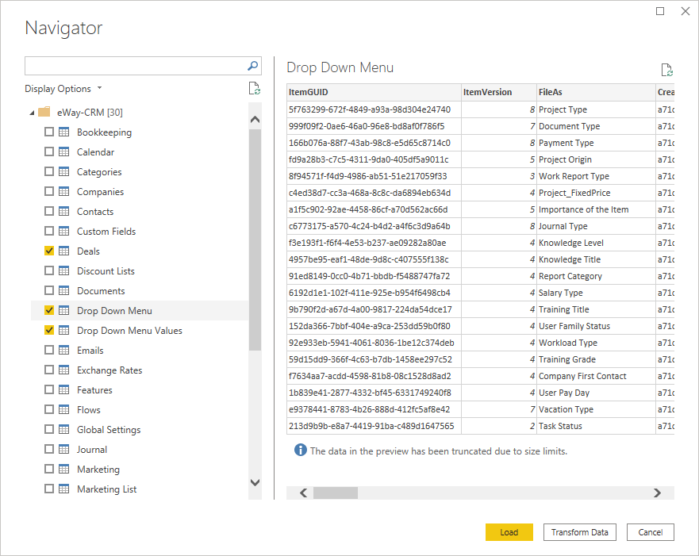

# PowerBI
Using this data source users are able to build reports in PowerBI using data from [eWay-CRM](https://www.eway-crm.com).

# Install Connector

To get started you need to first create `[Documents]\Power BI Desktop\Custom Connectors` directory.

After that download the latest version of the [eWay-CRM Data Source](https://github.com/eway-crm/PowerBI/releases/latest/download/eWay-CRM.mez) into `[Documents]\Power BI Desktop\Custom Connectors` directory.

As soon as you start PowerBI Desktop you will notice a warning about **Uncertified Connectors**.

To get rid of this warning you need to modify security settings as displayed on the picture below. Go to **Security** tab in the **Options** dialog. After you apply the changes restart Power BI Desktop.

# Get Data

As soon as eWay-CRM Data Connector is installed start PowerBI Desktop again and click on the Get Data.

Locate eWay-CRM in the data sources.

Fill in your eWay-CRM credentials. After that Navigator menu will appear with all supported tables.

Select required tables and click **Transform Data** to convert JSON structure to a Table.

Click on the Expand icon in the Column1 header and select required columns. After you click OK data will be converted to a table.

